### 1. Követelményanalízis
#### 1.1. A Program Célja
  
 - Az alkalmazás lényegében véve egy TODO alkalmazás, melynek segítségével fel tudjuk jegyezni azokat a számunkra fontos dolgokat, amiket nem szeretnénk elfelejteni és fontos, hogy időben megcsináljuk őket. Ezen alkalmazás segítségével készíthetünk sima jegyzeteket, vagy akár ketogorizálva is felvehetjük az éppen aktuális tennivalóinkat, legyen az bevásárlás, takarítás vagy netán kertészkedés. Itt mindent egy helyen tudunk tárolni és gyorsan elérhető.
 + Az alkalmazás lényegében véve egy TODO alkalmazás, melynek segítségével fel tudjuk jegyezni azokat a számunkra fontos dolgokat, amiket nem szeretnénk elfelejteni és fontos, hogy időben megcsináljuk őket. Ezen alkalmazás segítségével készíthetünk sima jegyzeteket, vagy akár kategorizálva is felvehetjük az éppen aktuális tennivalóinkat, legyen az bevásárlás, takarítás vagy netán kertészkedés. Itt mindent egy helyen tudunk tárolni és gyorsan elérhető.
  
  Természetesen ezen jegyzetek csak a bejelentkezett felhasználók részére érhetőek el, aki vendégként érkezik az oldalra, az regisztráció után be tud jelentkezni és máris használhatja a felületet.
###### Funkcionális követelmények:
 + Regisztráció
   + A regisztráció során a felhasználónak meg kell adnia:
     + Felhasználónév (ellenőrizve lesz, hogy foglalt-e)
     + E-mail
     + Jelszó (kis-nagy betű, spec karakter, legalább 8 karakter)
 + Bejelentkezés
   + Azonosítás:
     + felhasználónév + jelszó megadása
   + Bejelentlezett felhasználók részére:
      + A főoldalon talál egy leírást arról, hogy mit hogyan kell használni
      + A Notes oldalon látja az összes felvett jegyzetét és ezeket tudja törölni vagy szerkeszteni
      + Az "+ Add Notes" menüpont fel tud venni úgy jegyzetet
      + Az "+ Add Todos" menüpont alatt új teendőt tud felvenni és még nem létező kategória esetén kategóriákat tud készíteni és a teendőt valamelyikhez hozzá tudja relndelni
      + A Todos oldalon meglévő elemeket kategóriákhoz rendelheti és kategóriák szerint megjelenítheti, valamint teendőket törölhet, szerkeszthet
         
###### Nem funkcionális követelmények:
  + **Könnyű áttekinthetőség:** Használjuk olyan színeket, melyek nem zavarók a felhasználóra nézve, legyen olvasható minden szöveg, a feliratok legyenek egyértelműek
  + **Használhatóság:** Könnyű áttekinthetőség, ésszerű elrendezés, könnyű kezelhetőség, minden nagyjából egy kattinstásra legyen
  + **Megbízhatóság:** jelszóval védett funkciók, és a jelszavak védelme a háttérben. Hibásan bevitt adatok esetén a program jól láthatóan jelezzen a felhasználónak, és emelje ki a hibás beviteli mezőket. A jól bevitt adatok maradjanak az űrlapban.
  + **Megbízhatóság:** Jelszóval védett funkciók, és a jelszavak védelme a háttérben. Hibásan bevitt adatok esetén a program jól láthatóan jelezzen a felhasználónak, és emelje ki a hibás beviteli mezőket. A jól bevitt adatok maradjanak az űrlapban.
  + **Karbantarthatóság:** könnyen lehessen bővíteni, a különböző típusú fájlok külön csoportosítva, ésszerűen legyenek felbontva, a könnyebb fejleszthetőség miatt
  
#### 1.2. Szakterületi fogalomjegyzék
  + **Note:** Jegyzet, rendelkezik névvel és tartalommal
  + **Todo:** Elvégzendő feladat, csak névvel rendelkezik
  + **Add Todo:** Elvégzendő feladat hozzáadása
  + **Add Note:** Jegyzet hozzáadása
  + **Category:** Kategória, minden elvégzendő feladat egy adott kategóriához van hozzárendelve
  + **Edit:** Szerkesztés
  
#### 1.3. Használatieset-modell, funkcionális követelmények
**Vendég:** Csak a publikus oldalakat éri el

   + Bejelentkezés / Regisztráció
  
**Bejelentkezett felhasználó:** A publikus oldalak elérésén felül egyéb funkciókhoz is hozzáfér.
  
  + **Főoldal (Home):** Ez az oldal tartalmaz egy leírást arról, hogy milyen menüpontok alatt mit talál, és hogy hogyan tud felvenni új jegyzetet, illetve teendőt.
  + Jegyzetek (Notes)
  + Teendők (Todos)
  + Új jegyzet felvétele (Add Note)
  + Új teendő felvétele (Add Todo)
  + Meglévő jegyzet törlése
  + Meglévő kategória törlése
  + Meglévő teendő törlése kategóriából
  + Meglévő jegyzet szerkesztése
  + Meglévő teendő szerkesztése
  

**Egy folyamat leírása**
  + **Meglévő jegyzet szerkesztése:**
   1. A felhasználó az oldalra érkezve bejelentkezik vagy regisztrál
   2. Regisztráció után megtekintheti a jegyzeteit listázó oldalt, ahol kiválaszthatja a szerkeszteni kívánt jegyzetet.
   3. Rákattint az "Edit" gombra
   4. Az "Edit" oldalon megadja az új adatokat (Név (name), Tartalom (content))
   5. A "Save (mentés)" gombra kattintva elmenti a változtatásokat

### 2. Tervezés
#### 2.1 Architektúra terv
###### 2.1.1 Komponensdiagram

###### 2.1.2. Oldaltérkép:
**Publikus**
  + Bejelentkezés / Regisztráció
**Bejelentkezett**
  + Főoldal
  + Jegyzetek
    + Új jegyzet felvétele
    + Jegyzet törlése
    + Jegyzet szerkesztése
  + Teendők
    + Új teendő felvétele
    + Teendő szerkesztése
    + Teendő törlése
    + Kategória törlése (hozzátartozó teendőkkel együtt)
    + Kategória nevének megváltoztatása
    + Adott kategóriához teendő felvétele
   
###### 2.1.3 Végpontok
  + GET / : főoldal
  + GET /notes : jegyzetek oldal
  + GET /todos : teendők oldal
  + GET /loginSignUp : bejelentkező / regisztrációs oldal
  + POST /login : bejelentkező adatok felküldése
  + POST /register : regisztrációs adatok felküldése
  + GET /logout : kijelentkezés (átirányítás a bejelentkező oldalra)
  + GET /createNote : új jegyzet készítése
  + POST /createNote : új jegyzet felvételéhez szükséges adatok felküldése
  + GET /editNote/:id : jegyzet módosítása (oldal megjelenítése az adatokkal)
  + GET /deleteNote/:id : jegyzet törlése
  + POST /editNote/:id : jegyzet tényleges módosítása a beadott adatok felküldésével
  + POST /addCategory : kategória hozzáadása az adatok felküldésével
  + GET /createTodo : úgy teendő készítése (oldal megjelenítése)
  + POST /createTodo : új teendő felvételéhez szükséges adatok felküldése
  + GET /editTodo/:id : teendő modósítása (oldal megjelenítése)
  + POST /editTodo/:id : teendő tényleges modósítása a bevitt adatok felküldésével
  + POST /editCategory/:id : kategória módosítása a bevitt adatok elküldésével
  + GET /deleteTodo/:id : teendő törlése
  + GET /deleteCategory/:id : kategória törlése (törli a hozzá tartozó teendőket is)
  
#### 2.2. Felhasználói-felület modell
###### 2.2.1 Oldalvázlatok:

**Bejelentkezés / Regisztráció**
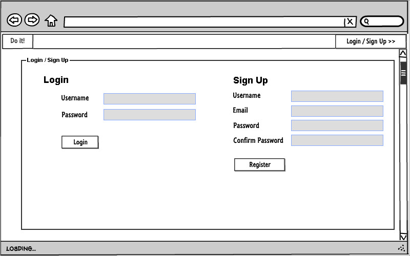

**Főoldal**

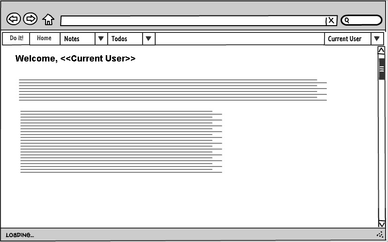

**Jegyzetek (Notes)**
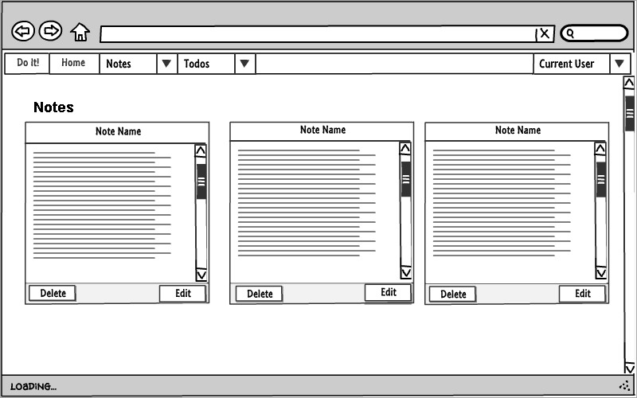

**Jegyzet felvétele (Add note)**
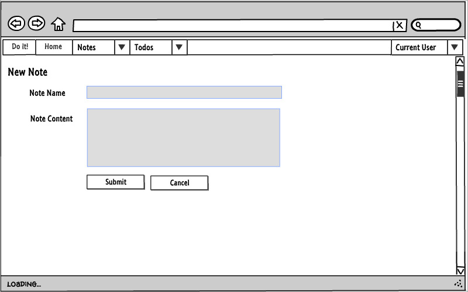

**Jegyzet szerkesztése (Edit note)**
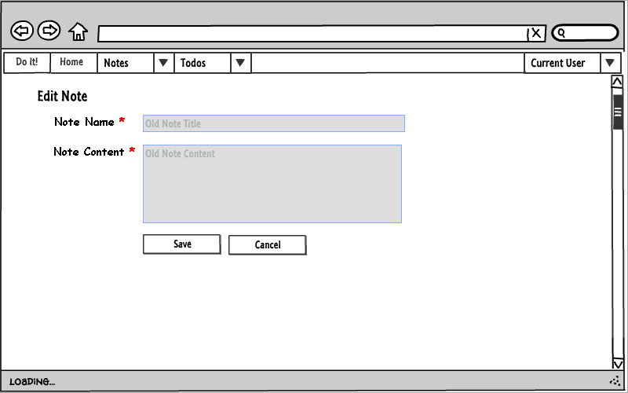

**Teendők (Todos)**
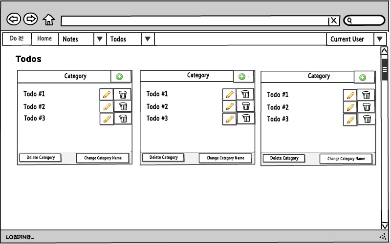

**Teendő felvétele**
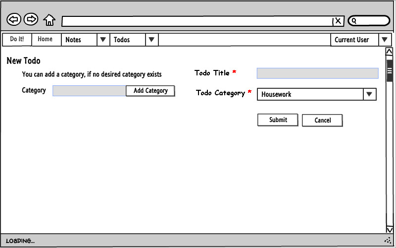

**Teendő szerkesztése**
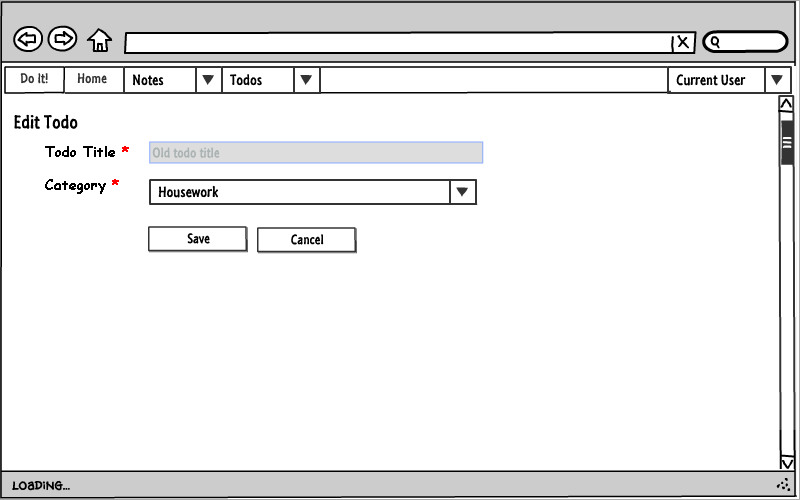

#### 2.2.2.Designtervek (végső megvalósítás kinézete):

**Bejelentkezés / Regisztráció**
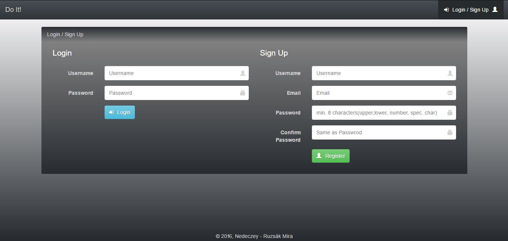

**Sikeres regisztráció**
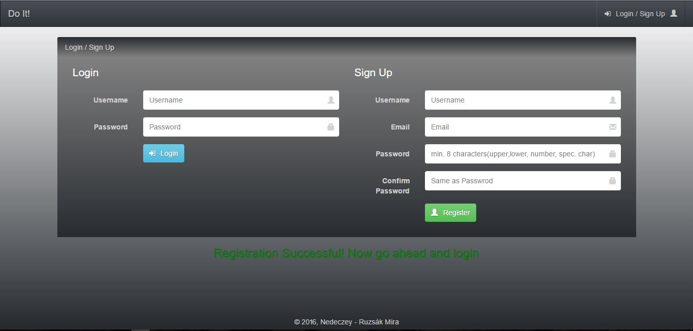

**Rossz jelszó**
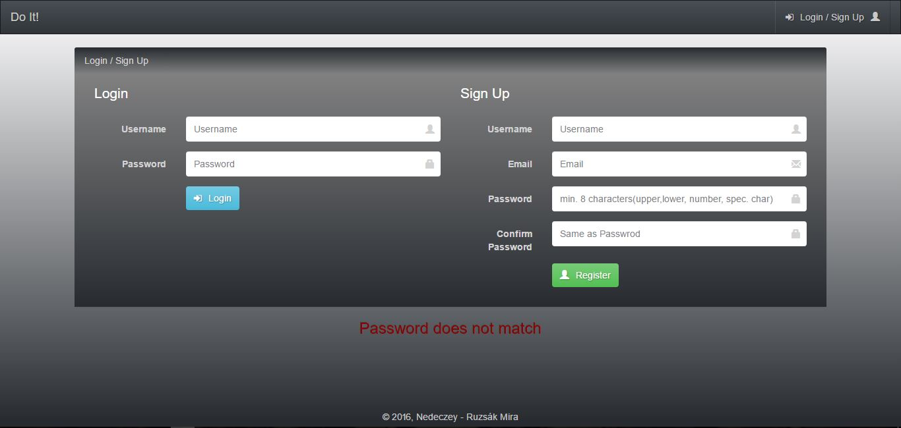

**Főoldal**
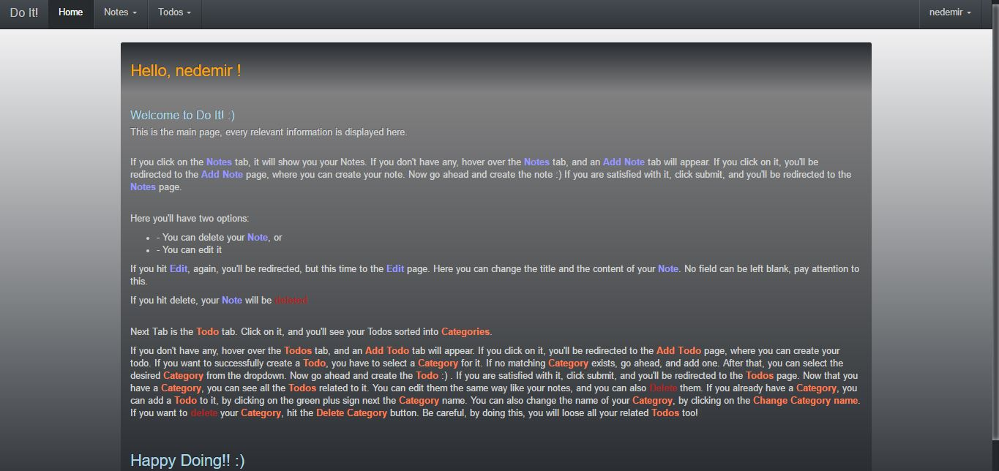

**Jegyzetek (Notes)**
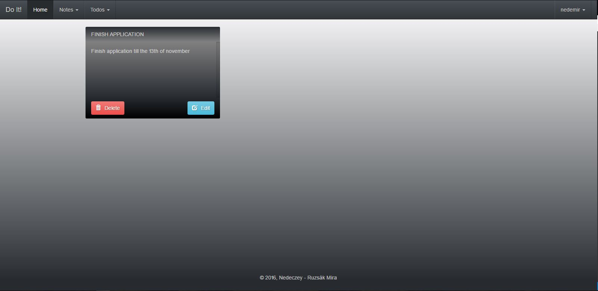

**Jegyzet felvétele menüpont**
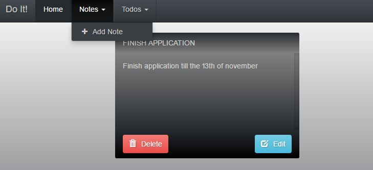

**Jegyzet felvétele (Add note)**

**Jegyzet szerkesztése (Edit note)**
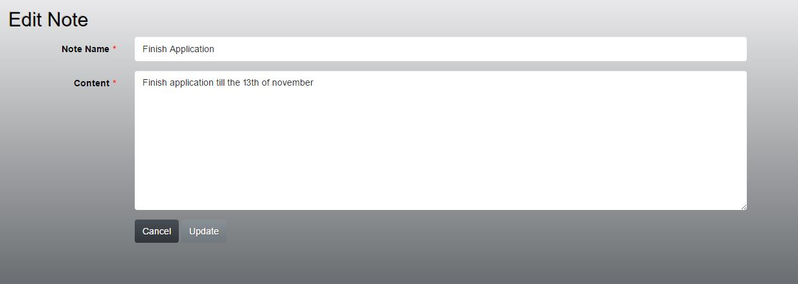

**Teendők (Todos)**
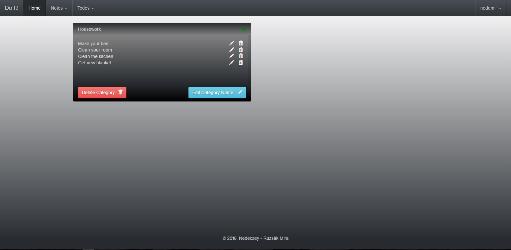

**Teendő felvétele menüpont**

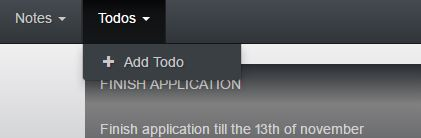

**Teendő felvétele**
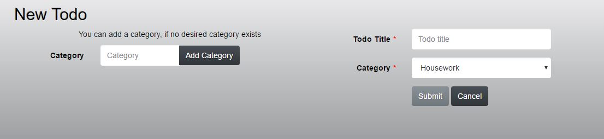

**Teendő felvétele adott kategóriához**

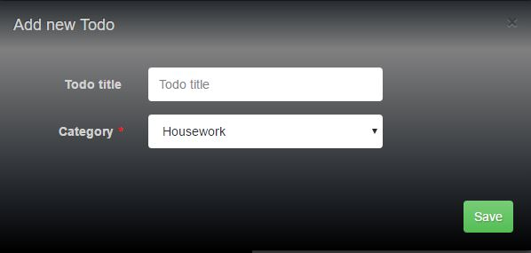

**Teendő szerkesztése**

**Kategória nevének szerkesztése**

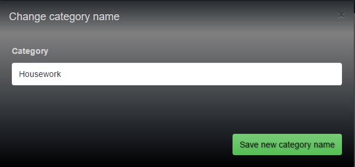

**Kijelentkezés opció**

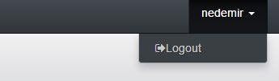

#### 2.2.3. Osztálymodell
**Adatmodell**

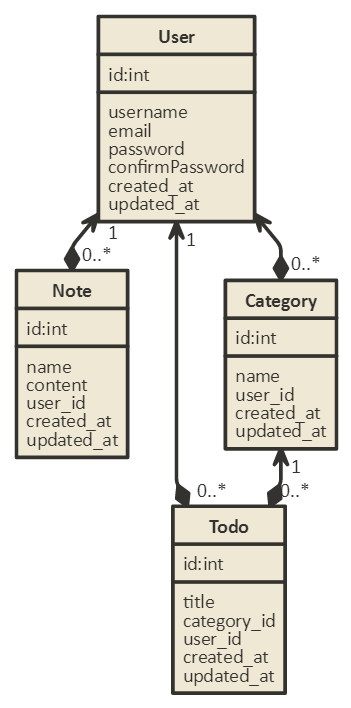

#### 2.2.4. Dinamikus működés
**Szekvencia diagram**

Vegyük példának a regisztrációt, majd egy új elem felvételét, szerkesztését, törlését, mindezt szekvenciadiagrammon.

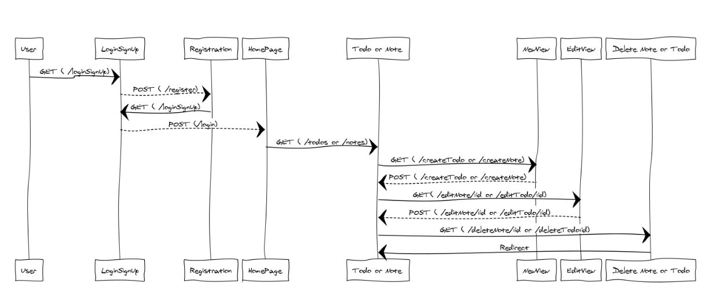

#### 3. Implementáció
###### Fejlesztőkörnyezet

Visual Studio Code + Adonis.js + Node.js + Express Admin
  
  + Telepítsük a Node.js-t (töltsük le a legfrisebb változatot)
  + Github account szükséges, további információk itt találhatók a git konfigurálásához:
    + [Github config ] (https://git-scm.com/book/en/v2/Getting-Started-First-Time-Git-Setup)
  + Githubon létrehozunk egy új repositoryt
  + A saját gépünkön tetszőleges helyen létrehozunk egy mappát
  + Command line megnyitása, majd lépjünk be ebbe a mappába
  + Adjuk ki ezt a parancsot: git config --global url."https://".insteadOf git://
  + Majd ezt: npm i adonis-cli hogy telepítsük az adonist
  + Majd: git clone https://github.com/username/reponame.git
  + Majd állítsuk be a git repót, ahova dolgozni fogunk: git remote add origin https://github.com/user/repo.git
  + Miután leklónoztuk a repositoryt, nyissuk meg visual studio code-ban
  + A command line-ban írjuk be ezt a parancsot, hogy locálban fusson a serverünk: npm run dev
  + Majd ugyan ebbe a mappába telepítsük az adatbázis kezelőnket is: npm i --save sqlite3
  + Majd config/database.js beállítása
  + Majd User tábla létrehozása: node ace auth:setup
  + Majd ugyan ebbe a mappába telepítjük az express-admint: npm install express-admin
  + Konfig mappa: mkdir config\express-admin
  + Indítás: node_modules\.bin\admin config\express-admin
  + Böngésző: Localhost:4444 (ezen fut az express-admin) és localhost:3333 (ezen fut a node.js server)
  
  
